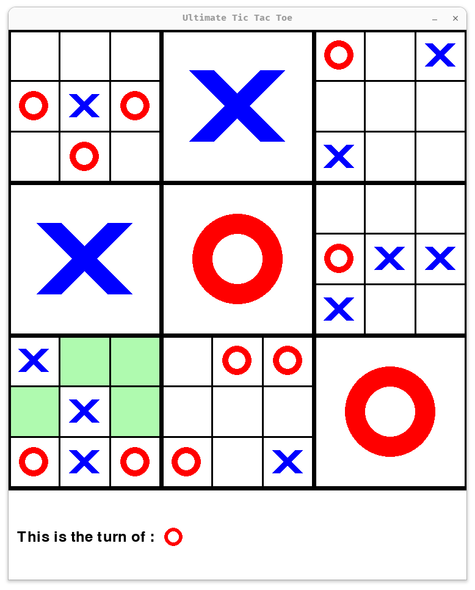

# Ultimate tic-tac-toe AI 

This project is an AI agent for playing **Ultimate Tic-Tac-Toe**, developed as part of a course on Artificial Intelligence for games during my fourth year at INSA Rennes. The AI can play automatically using strategies like **Monte Carlo Tree Search (MCTS)**.

Ultimate Tic-Tac-Toe is an advanced version of classic Tic-Tac-Toe: each small board must be won individually, and the position of a move dictates where the opponent can play next.




## Quick start
Install dependencies:
```bash
uv sync
```

Run the game with default settings (player against AI):
```bash
uv run python src/main.py
```
Press **SPACE** at any time to let the AI play the next move automatically for the player.

## Command-Line Arguments

The game can be configured using the following options:
| Argument | Type | Default | Description |
| :--- | :--- | :--- | :--- |
| **`--nb_games`** | `int` | `1` | Number of games to simulate |
| **`--display_game`** | `bool` | `True` | Display the game on screen (`True`/`False`) |
| **`--size_board`** | `int` | `100` | Size of the game board |
| **`--player1_auto`** | `bool` | `False` | Make player 1 automatic (`True`/`False`) |
| **`--player1_strategy`** | `str` | `'random_best'` | Strategy for player 1 (`mcts`/`random`/`random_best`) |
| **`--player2_auto`** | `bool` | `True` | Make player 2 automatic (`True`/`False`) |
| **`--player2_strategy`** | `str` | `'mcts'` | Strategy for player 2 (`mcts`/`random`/`random_best`) |
| **`--mcts_iterations`** | `int` | `80` | Number of MCTS iterations (Increase the number to have a greater challenge) |
| **`--save_results`** | `str` | `None` | Folder to save game results |